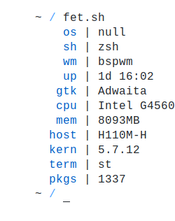

<div align="center">
<h1>fet.sh</h1>
a fetch written in POSIX shell with no external commands
<br>

</div>

### Installing
**Arch:** [fet.sh-git](https://aur.archlinux.org/packages/fet.sh-git) (AUR)  
**Gentoo:** [app-misc/fetsh](https://gpo.zugaina.org/Overlays/guru/app-misc/fetsh) (GURU overlay)  
**KISS:** [fetsh](https://github.com/kisslinux/community/tree/master/community/fetsh) (Community)  
**Nix:** [fet-sh](https://search.nixos.org/packages?show=fet-sh&query=fet-sh&channel=unstable) (nixpkgs-unstable)  
Alternatively, copy `fet.sh` to somewhere in $PATH and mark it as executable (`chmod +x fet.sh`)

### Customization
`fet.sh` has a few basic configuration options using environment variables, for example:
```
$ info='n os wm sh n' fet.sh
```
Supported options are:
- `accent` (0-7)
- `info`
- `separator`
- `colourblocks`

For less simple configuration I recommend editing the script, I tried to keep it simple.

### Known Issues
BSD and Android don't show much info.
